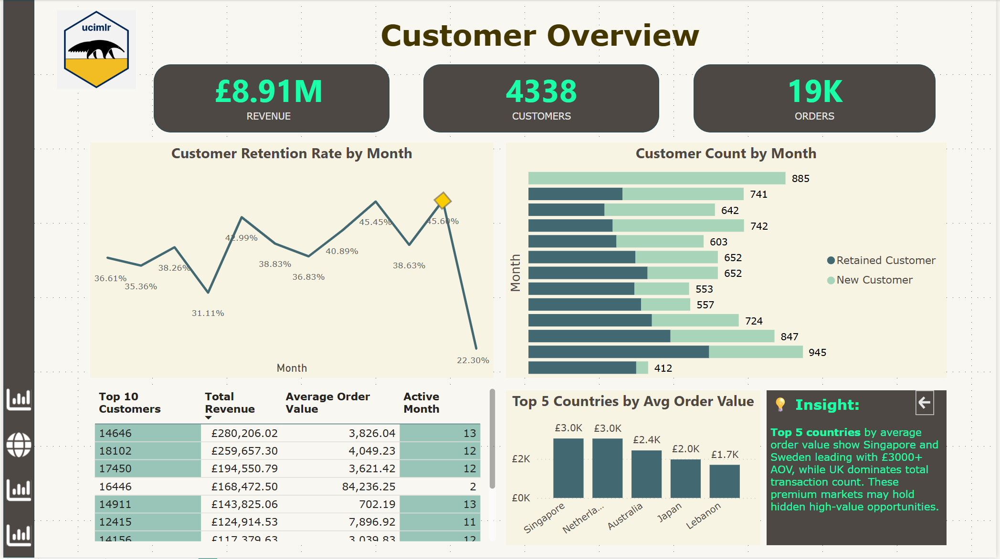
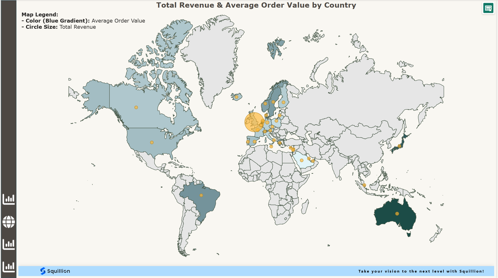
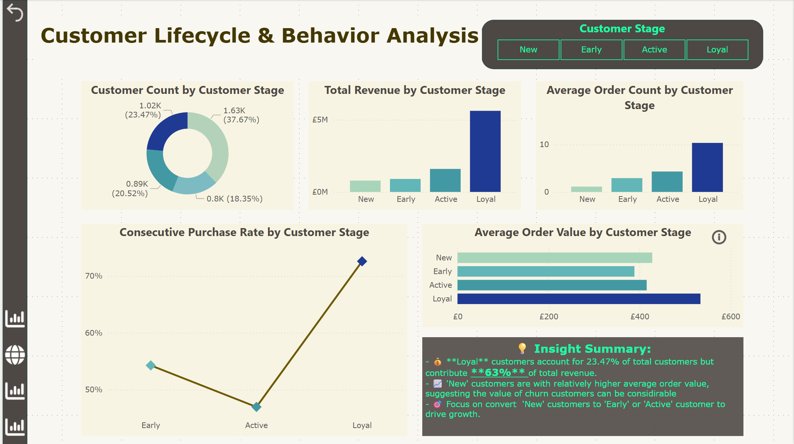
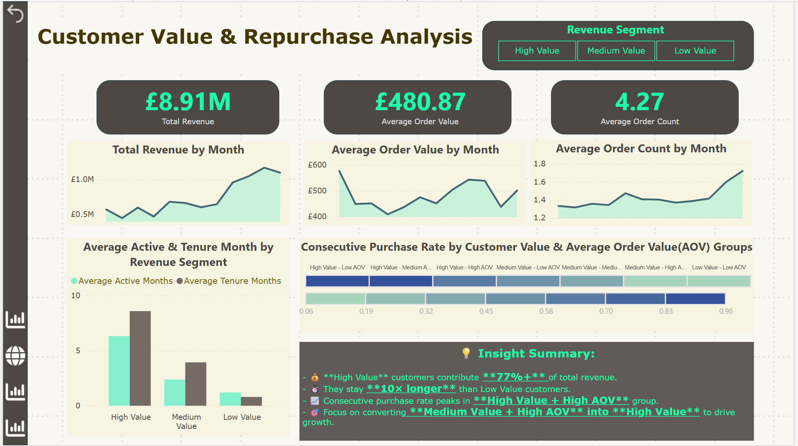

# 🧠 Customer Retention & Repurchase Analysis Dashboard

## 📊 Overview

This project presents an end-to-end data analytics solution that examines customer retention behavior and repurchase patterns using a real-world e-commerce dataset. The solution includes data cleaning, SQL-based data modeling, Power BI dashboard design, and DAX metric construction.

The final dashboard delivers insights across four key pages:

1. **Customer Overview**
2. **Geographic Distribution Map**
3. **Customer Lifecycle & Behavior Analysis**
4. **Customer Value & Repurchase Analysis**

---

## 🗃️ Dataset

- **Source**: [UCI Online Retail Dataset](https://archive.ics.uci.edu/dataset/352/online+retail)
- **Period**: 01/12/2010 to 09/12/2011
- **Transactions**: UK-based non-store online retail
- **Citation**: Chen, D. (2015). Online Retail [Dataset]. UCI Machine Learning Repository. [https://doi.org/10.24432/C5BW33](https://doi.org/10.24432/C5BW33)
- **Original Columns**: `InvoiceNo`, `StockCode`, `Description`, `Quantity`, `InvoiceDate`, `UnitPrice`, `CustomerID`, `Country`

---

## 🏗️ Project Structure

```
├── 📁 SQL_Modeling/
│   ├── Data_Modeling_Logic.md        # SQL modeling strategy & table structure
│   └── SQL_Scripts.sql               # Core SQL queries
│
├── 📁 DAX_Formula_Summary/
│   └── key_measures.md              # All KPI measures used in Power BI
│
├── 📁 Dashboard_Screenshots/        # Optional: Dashboard images
│
├── 📁 Presentation_PPT/             # Optional: Project presentation slides
│
└── README.md                        # Project overview (this file)
```

---

## 🧩 Tools Used

- **Google BigQuery**: SQL-based data cleaning and modeling
- **Power BI**: Visualization and DAX measure construction
- **Power Query**: Initial data exploration
  
---
## 📊 Dashboard Preview

### 1. Customer Overview


### 2. Map


### 3. Customer Lifecycle & Behavior Analysis


### 4. Customer Value & Repurchase Analysis


---

## 🔍 Key Features

- Exclusion of NULL Customer IDs and return/adjustment orders
- Monthly-level cohort behavior analysis
- Customer lifecycle segmentation (`New`, `Early`, `Active`, `Loyal`)
- Value segmentation (`High`, `Medium`, `Low` revenue & AOV)
- Retention and churn calculations
- Bookmark-based dynamic page interactions
- Custom visual theme via JSON theme file

---

## 📈 Business Insights Delivered

- Customer count steadily increased from September to December 2011.
- Retention rate fluctuated month-over-month but shows a long-term upward trend.
- "Medium Value" customers contribute significantly to revenue but have lower retention.
- Countries like Singapore and Sweden show high AOV, indicating high-margin potential.
- "Loyal" customers have longer tenure and generate higher revenue per customer.
- Focus on converting **Medium Value + High AOV** customers into **High Value** to drive revenue growth.
- New customers have higher AOV than Early and Active segments, suggesting churned customers may hold hidden value.
- Priority should be placed on converting 'New' customers into 'Early' or 'Active' to improve long-term retention and engagement.

---
## 🧠 Skills Demonstrated

- SQL Data Modeling
- DAX Measures and Context Logic
- Interactive Dashboard Design
- Business Storytelling & Metric Selection
- Stakeholder-Oriented Scope Definition
- Power BI Theme Customization via JSON

---

## 🚀 How to Run

1. Upload the dataset to Google BigQuery.
2. Run SQL scripts to generate fact tables.
3. Connect the modeled tables to Power BI.
4. Apply the provided DAX measures.
5. Configure bookmarks and page navigation.
6. Customize color theme using the provided JSON file.

---
## 📁 Power BI File

Download the interactive dashboard `.pbix` file here:

👉 [Download Power BI Dashboard (Google Drive)](https://drive.google.com/file/d/1sHFEj5JTSPYZ1o_OCT9qUEYTGr9Wi2Yo/view?usp=drive_link)

---
## 🙋‍♀️ Author

**Amy Zhou**\
Data Analyst | SQL • Power BI • Python • Business Insight

📧 [LinkedIn Profile](https://www.linkedin.com/in/your-profile): [https://www.linkedin.com/in/zhou-huimin-548245134/](https://www.linkedin.com/in/zhou-huimin-548245134/)

---

Feel free to fork, star, and explore!

